# LAB-41-SWITCH-
Tanggal 22 agustus 2025 

# switch
  Switch adalah perangkat keras jaringan yang berfungsi sebagai pusat transfer data antar perangkat, memungkinkan data dikirim ke perangkat yang dituju secara efisien, terutama dengan bantuan switch chip pada router Mikrotik untuk mempercepat transfer data antar port tanpa membebani CPU. Selain itu, switch juga dapat memiliki sistem operasi khusus seperti SwOS Mikrotik yang mendukung fitur-fitur seperti VLAN, QoS, dan Spanning Tree Protocol, serta berbagai jenis produk Mikrotik seperti CRS dan CSS dengan keunggulan masing-masing. fitur Switch chip di Routerboard, memiliki berbagai jenis Switch chip yang ditanam di Routerboard. Meski sama-sama memiliki fungsi Switch, tetapi masing-masing memiliki satu set fitur yang berbeda. Fitur Switch chip memungkinkan Port ethernet melewatkan data dengan kecepatan selayaknya port Switch biasa atau memungkinkan transfer data antar port bisa mencapai cable speed tanpa membebani processor.
  
Berikut adalah daftar Switch chip dan fitur yang dimiliki: 

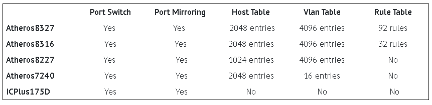

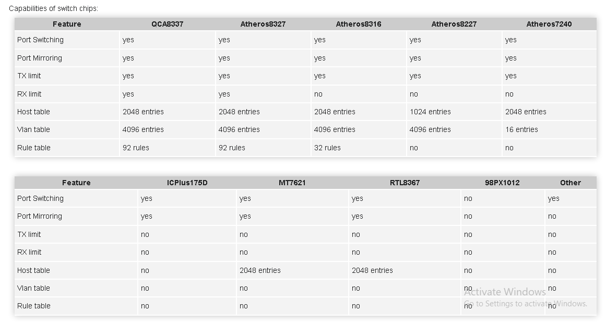

Berikut daftar Routerboard series dengan Switch chip-nya:

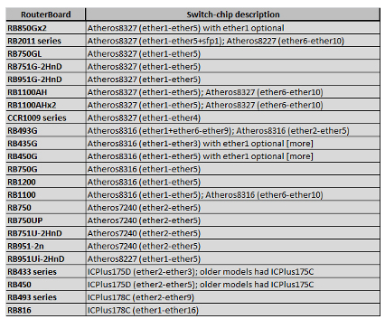

# konfigurasi vlan di routerboard menggunakan switch chipset (hardware)  

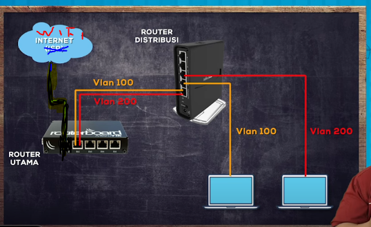

# konfigurasi router utama 
1. masuk ke winbox  
2. lakukan konfigurasi dasar hingga winbox bisa terkoneksi internet   
3. selanjutnya karena kita akan membuat vlan 100 dan 200 maka kita harus buat interface dulu  
   pilih menu interface > tab interface klik (+) lalu tab general. interface nya saya menggunakan interface ether 1 karena isp saya itu dari wlan.

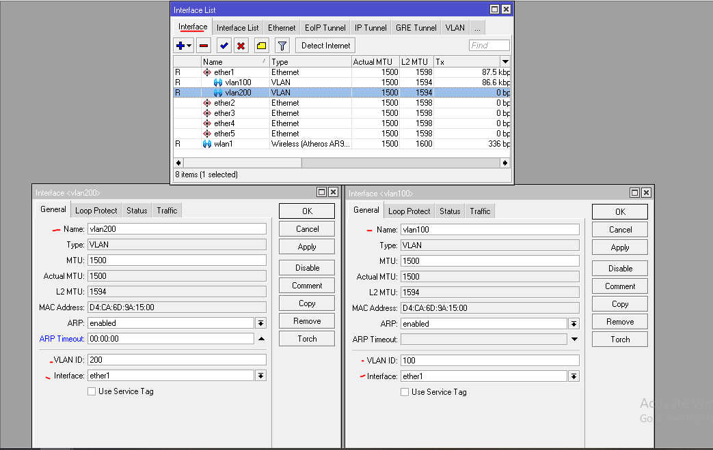

4. salu kita buatkan ip address buat interface vlan 100 dan 200  
   piih menu ip > address klik (+)

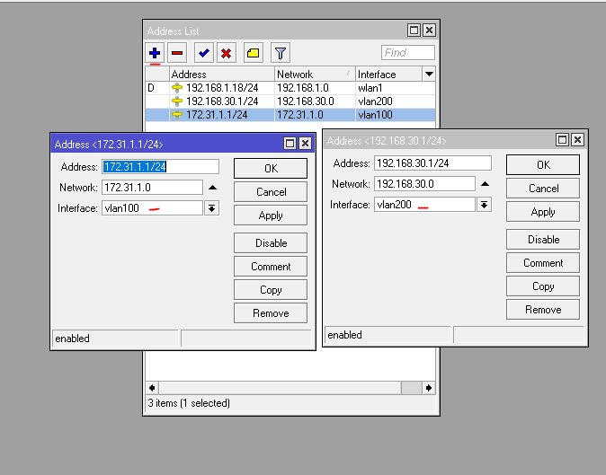

5. terus tambahkan dhcp server untuk vlan 100 dan 200  
   di menu ip > dhcp server > dhcp stup   
   klik next hingga selesai   

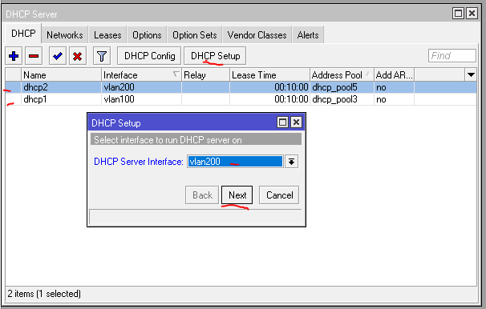

6. baik konfigurasi di router utama telah selesai   

# Konfigurasi router distribusi
1. masuk ke winbox
2. lihat menu switch untuk melihat ether mana yang suport sebagai switch chipset   
   serta lihat type nya karen setiap type memiliki fungsi yang berbeda untuk mengelola vlan seperti yang ada di tabel di atas 

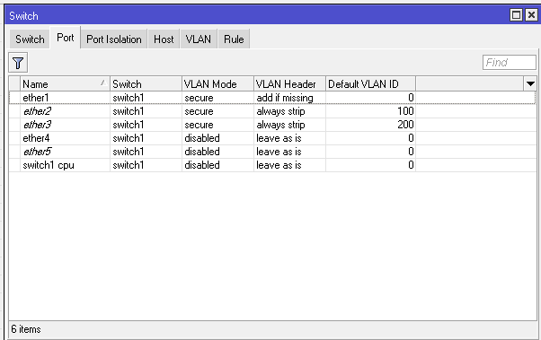

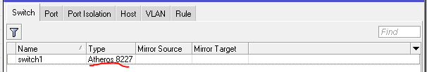

3. buatkan bridge untuk melewatkan vlan ke laptop.  
   pilih menu bridge > tab bridge klik (+)   
   
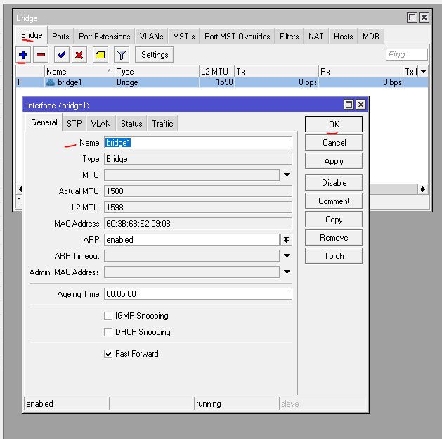
   
4. masukkan interface mana sajah yang akan masuk ke bridge. ether 1  sebagai interfaace yang terhubung ke router utama yang membawa 2 vlan. ether 2 dan 3 itu interface yang akan membagikan vlan ke client
5. pilih menu bridge > port klik (+) masukan port interface ether 1, 2, 3,  

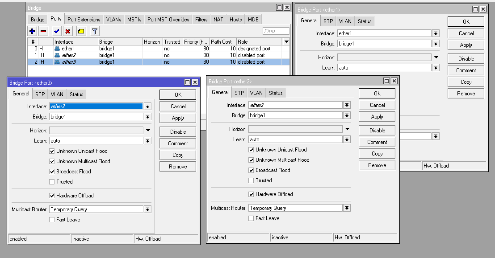

6. lanjut untuk memetakan vlan nya kita masuk ke menu switch > vlan   
   masukan vlan id 100 dan port trunkking nya ether1 dan access nya ether 2 lalu yang 200 access nya yang ether 3  

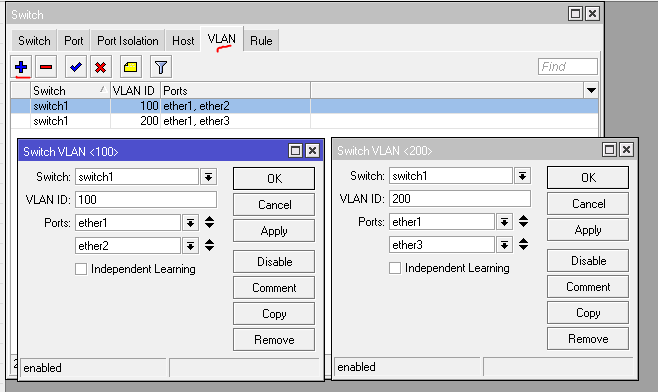

7. lalu ke tab switch port untuk ether 1/trunkking pilih vlan mode nya secure dan vlan header nya add if missing  lalu ether 2 dan 3 yang kita gunakan sebagai vlan access pilih vlan mode nya secure dan vlan haeder nya always strip yang aakn menghilangkan vlan tagging yg dari vlan trunkkingnya jangan lupa masukkan vlan id nya ether 2 100 dan 3 200 

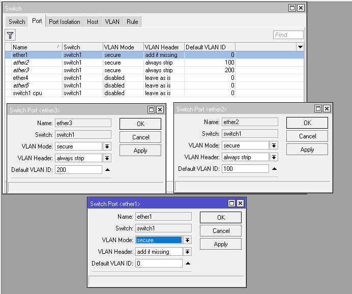

# pengujian 

laptop ether 2  

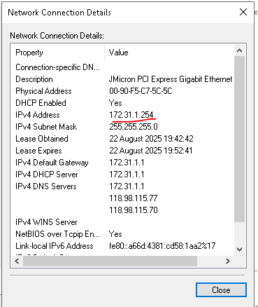

laptop ether 3   

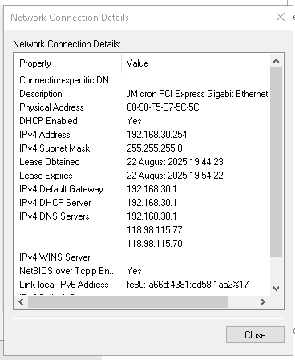

karena sudah bisa berarti sudah berhasil   

# kesimpulan 

Konfigurasi VLAN pada Routerboard dengan menggunakan switch chipset (hardware switching) memberikan performa yang lebih tinggi dan efisien dibandingkan dengan metode software-based VLAN. Dengan memanfaatkan fitur switch chip bawaan Routerboard, proses tagging dan untagging VLAN dapat dilakukan secara langsung di lapisan hardware, sehingga:  
Meningkatkan kinerja jaringan karena meminimalkan beban kerja CPU Routerboard. Lebih efisien dalam pengelolaan lalu lintas antar VLAN karena pemrosesan dilakukan oleh hardware switch chip. Cocok digunakan untuk jaringan skala kecil hingga menengah yang membutuhkan segmentasi jaringan tanpa mengorbankan performa.

# sumber 
https://youtu.be/Cu_0XQO8MG0?si=amxpGqZmo01I-fL_
